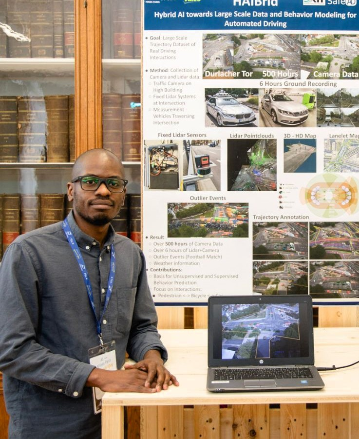

#
 

Colombe M'Boungou

I am an AI Research Engineer in the [Multispeech](https://www.inria.fr/en/multispeech) team at INRIA Lorraine in Nancy (France).
I am currently working on the [REAVISE project](https://msaadeghii.github.io/projects/) (Robust and Efficient Audio-Visual Speech Enhancement) using Deep Generative Models with Researcher [Mostafa Sadeghi](https://msaadeghii.github.io/) and PhD Jean-Eudes Ayilo.

I did a Master's in [Data Science, AI and Machine Learning](https://www.hh.se/english/education/programmes/masters-programme-in-information-technology---data-science-ai-and-machine-learning.html) at Halmstad University (Sweden) and a Master's in Electronics and Telecommunications at the ENSIL (Ecole Nationale Supérieure d'Ingénieurs de Limoges, France).
